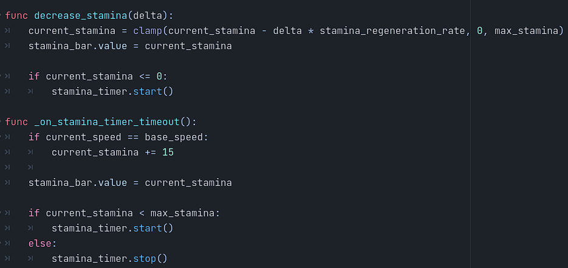

# Platformer 2D : Bugs Slayer

## Gabriel Racine

### Introduction
Le Platformer 2D que j'ai développé offre une expérience immersive en combinant divers éléments de conception, du comportement intelligent des ennemis à la gestion de la stamina du joueur. Les joueurs exploreront des environnements dynamiques, affrontant des ennemis réactifs et utilisant stratégiquement leur stamina pour progresser.

### Concepts Utilisés

#### Raycast pour le Comportement de l'Ennemi
- **Description du Concept**: L'ennemi utilise un raycast pour détecter les obstacles tels que les murs ou le vide, déterminant ainsi la direction à prendre. Cette approche offre une réactivité accrue de l'ennemi aux changements dans son environnement.
- **Source de l'Information**: [Répertoire Github Godot](https://github.com/godotengine/godot-demo-projects/tree/master/2d/platformer/enemy)
- **Capture d'Écran**:

---

#### Shaders pour l'Ennemi et le Texte de la Scène Win
- **Description du Concept**: L'ennemi est doté de shaders combinés pour créer des effets visuels uniques. De plus, un shader spécifique est appliqué au texte de la scène Win, ajoutant une esthétique particulière à la victoire du joueur.
- **Source de l'Information**: [Introduction aux Shaders](https://github.com/nbourre/0sw_notes_cours/tree/main/shaders)
- **Capture d'Écran**: 

---

#### Parallax Background
- **Description du Concept**: Un arrière-plan en parallaxe crée une illusion de profondeur, améliorant l'aspect visuel global du jeu. Cette technique consiste à déplacer des couches d'arrière-plan à des vitesses différentes pour simuler la perception de la profondeur.
- **Source de l'Information**: [ParallaxBackground avec Godot](https://github.com/nbourre/0sw_notes_cours/tree/main/parallaxe)
- **Capture d'Écran**: 

---

#### Comportement de Boid dans le Menu Principal
- **Description du Concept**: Un algorithme de comportement de Boid est utilisé dans le menu principal pour simuler des entités autonomes qui évitent les autres entités du même groupe et réagissent à la position de la souris. Cette fonctionnalité ajoute une dimension interactive au menu principal.
- **Source de l'Information**: [Introduction aux Boids](https://github.com/nbourre/0sw_processing_exemples)
- **Capture d'Écran**: 

---

#### Machine à États (AnimationTree)
- **Description du Concept**: Une machine à états gère les différents états du joueur, tels que "walk", "run", "idle", "jump", "fall", "land", et "attack". Cette approche organise de manière efficace le flux du jeu en fonction des actions de l'utilisateur et de l'état actuel du joueur.
- **Source de l'Information**: [Documentation sur les Machines à États](https://github.com/nbourre/0sw_notes_cours/tree/main/animation_tree)
- **Capture d'Écran**: 

---

#### Gestion de la Stamina
- **Description du Concept**: Mise en place d'un système de stamina qui diminue lors de l'utilisation d'actions spécifiques, comme la course. La stamina se régénère avec le temps, et un timer (stamina_timer) est utilisé pour gérer ce processus de régénération, ajoutant une dimension stratégique au gameplay.
- **Capture d'Écran**: 
